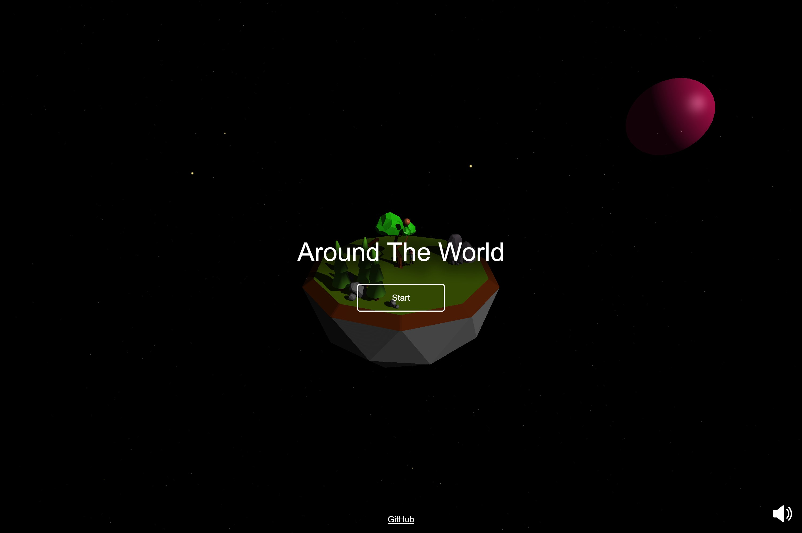

<h1 align="center">
      
    Around The World
</h1>

A 3D JavaScript game built with WebGL using the [three.js](https://github.com/mrdoob/three.js) library, and the [cannon-es](https://github.com/pmndrs/cannon-es) physics engine.

## How to play

Avoid the meteors!

`WASD` to move

`SPACE` to jump

`SHIFT` to sprint

## Screenshots

